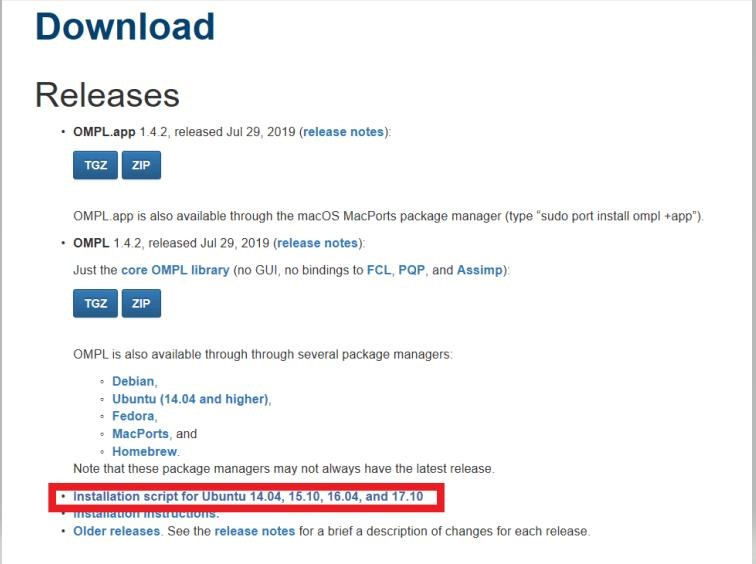

Part 1 代码执行流程

见文件：src/grid\_path\_searcheer/src/demo\_node.cpp 

**主函数 main** 

```java
int main(int argc, char** argv)
{
    ......
    // 订阅到地图信息的回调函数
    _map_sub  = nh.subscribe( "map",       1, rcvPointCloudCallBack );
    // 订阅到终点信息的回调函数
    _pts_sub  = nh.subscribe( "waypoints", 1, rcvWaypointsCallback );
    ......
    // 定义了结构体AstarPathFinder变量_astar_path_finder，该结构体存储、实现了Astar路径规划所需的所有信息和功能
    _astar_path_finder  = new AstarPathFinder();
    _astar_path_finder  -> initGridMap(_resolution, _map_lower, _map_upper, _max_x_id, _max_y_id, _max_z_id);

    _jps_path_finder    = new JPSPathFinder();
    _jps_path_finder    -> initGridMap(_resolution, _map_lower, _map_upper, _max_x_id, _max_y_id, _max_z_id);
}
```

**回调函数 rcvPointCloudCallBack**

```java
void rcvPointCloudCallBack(const sensor_msgs::PointCloud2 & pointcloud_map)
{
    ......
    // 将障碍物信息设置进入栅格化地图，为后续路径规划做准备
    _astar_path_finder->setObs(pt.x, pt.y, pt.z);
    _jps_path_finder->setObs(pt.x, pt.y, pt.z);

    // 可视化地图部分
    ......
    map_vis.header.frame_id = "/world";
    _grid_map_vis_pub.publish(map_vis);
    ......
}
```

**回调函数 rcvWaypointsCallback**

```java
void rcvWaypointsCallback(const nav_msgs::Path & wp)
{
    // 获取交互式界面给出的终点坐标
    Vector3d target_pt;
    target_pt << wp.poses[0].pose.position.x,
                 wp.poses[0].pose.position.y,
                 wp.poses[0].pose.position.z;
    ......

    // 输入起点、终点、调用pathFind函数
    pathFinding(_start_pt, target_pt); 
}
```

**路径规划函数 pathFinding**

```java
void pathFinding(const Vector3d start_pt, const Vector3d target_pt)
{
    // 使用A*进行路径搜索
    _astar_path_finder->AstarGraphSearch(start_pt, target_pt);

    // 获取规划的路径
    auto grid_path     = _astar_path_finder->getPath();
    auto visited_nodes = _astar_path_finder->getVisitedNodes();

    // 可视化结果
    visGridPath (grid_path, false);
    visVisitedNode(visited_nodes);

    // 为下次规划重置地图
    _astar_path_finder->resetUsedGrids();

    // 进行JPS路径规划编写时，将_use_jps的值置为1即可
#define _use_jps 0
#if _use_jps
    {
        // 使用JPS进行路径搜索
        _jps_path_finder -> JPSGraphSearch(start_pt, target_pt);
        ......
    }
#endif
}
```

Part2 涉及类和结构体的简介

**节点表⽰：⽤结构体变量 GridNode
表⽰，存储了节点的坐标、g(n)、f(n)值、⽗节点指针等信息。**

```java
struct GridNode
{     
    int id;        // 1--> open set, -1 --> closed set
    Eigen::Vector3d coord; 
    Eigen::Vector3i dir;   // direction of expanding
    Eigen::Vector3i index;
	
    double gScore, fScore;
    GridNodePtr cameFrom;
    std::multimap<double, GridNodePtr>::iterator nodeMapIt;

    GridNode(Eigen::Vector3i _index, Eigen::Vector3d _coord){  
		id = 0;
		index = _index;
		coord = _coord;
		dir   = Eigen::Vector3i::Zero();

		gScore = inf;
		fScore = inf;
		cameFrom = NULL;
    }

    GridNode(){};
    ~GridNode(){};
};
```

**父类AstarPathFinder**

```java
class AstarPathFinder
{
    private:

	protected:
        ......
        // open set实现：用C++ STL中的multimap
        std::multimap<double, GridNodePtr> openSet;

        // 启发式函数（待完成）
        double getHeu(GridNodePtr node1, GridNodePtr node2);

        // 拓展节点函数（待完成）
        void AstarGetSucc(GridNodePtr currentPtr, std::vector<GridNodePtr> & neighborPtrSets, std::vector<double> & edgeCostSets);
    public:
        ......
        // A*搜索算法函数（待完成）
        void AstarGraphSearch(Eigen::Vector3d start_pt, Eigen::Vector3d end_pt);
        ......
}
```

**open set实现：⽤C++ STL中的multimap实现，multimap将{key,value}当做元素，允许重复元素。multimap根据key的排序准则⾃动将元素排序，因此使⽤时只需考虑插⼊和删除操作即可。**

**详细信息可以查看以下⽂档：ttps://zh.cppreference.com/w/cpp/container/multimap
继承类JPSPathFinder**

```java
class JPSPathFinder: public AstarPathFinder
{
    ......
    // JPS 的拓展节点函数，已经完成
    void JPSGetSucc(GridNodePtr currentPtr, std::vector<GridNodePtr> & neighborPtrSets, std::vector<double> & edgeCostSets);

    //JPS 搜索算法函数，主体框架和 A\*一致，只要用心对照修改，在完成了A*的基础，使用提供的函数接口完成JPS难度不打
    void JPSGraphSearch(Eigen::Vector3d start_pt, Eigen::Vector3d end_pt);
}
```

Part 3 任务详情 

完成 src/grid\_path\_searcheer/src/Astar\_searcher.cpp 下的

```java
void AstarPathFinder::AstarGetSucc(...);
double AstarPathFinder::getHeu(...);
void AstarPathFinder::AstarGraphSearch(...);
vector<Vector3d> AstarPathFinder::getPath(...);
```

请仔细阅读代码中的注释，按照STEP 1 – STEP 8 的提示逐步完成。

Part 4 作业提交要求

(1)提交完整可编译运行的程序功能包grid\_path\_searcher

(2)撰写一篇**不超过2页A4纸**的文档，需要包含以下内容

(3)算法流程、运行结果

(4)对比不同启发式函数（Manhattan、Euclidean、Diagonal、Heuristic）对A\*运行效率的影响

(5)对比是否加入Tie Breaker对A\*运行效率的影响

(6)任何完成算法过程中遇到的问题、以及解决方法

(7)（选做）如果完成了JPS，最好附上A\*和JPS算法效率的分析（何种情况下A\*更优、何种情况下JPS更优？）

(8)（选做）以及其他你认为有趣的内容。 Part 5 拓展练习（选做）

在完成任务（1）的基础上，仿照**void**
AstarPathFinder::AstarGraphSearch(...)的写法，补全

**src/grid\_path\_searcheer/src/readonly/JPS\_searcher.cpp**下的 **void**
JPSPathFinder::JPSGraphSearch(...)，由于JPS和Astar仅在扩展节点时有区别，所以只需要仔细对照，并结合已经写好的**void**
JPSPathFinder::JPSGetSucc (...)；完成JPS难度不大。

## hw\_3 Part

### Matlab_work


打开工作文件夹，按照STEP提示完成RRT.m

### Ros_work

1.  准备工作

1.1 登录 ompl（The Open Motion Planning Library）官网：

[https://ompl.kavrakilab.org/index.html](https://ompl.kavrakilab.org/index.html)

1.2 进入 Download 页面，下载保存脚本文件 install-ompl-ubuntu.sh



1.3 运行脚本文件在脚本文件保存的路径下，右键打开终端，运行命令

```java
sudo chmod +x install-ompl-ubuntu.sh
./install-ompl-ubuntu.sh
```

1.4 创建工作空间，编译作业里的功能包（**首次编译无法通过，需要完善代码才能编译通过**）

2.  ROS 查找依赖包 ompl

2.1 修改 src/grid\_path\_searcher/CMakeLists.txt，使⽤find\_package()查找 ompl 的头⽂件、库路径等信息

```java
find_package(Eigen3 REQUIRED)
find_package(PCL REQUIRED)
# add your code here: find_package(xxx REQUIRED)
```

3.  在代码中添加使⽤到的 ompl 的头⽂件（该部分代码中已经添加）

⻅⽂件 src/grid\_path\_search/src/demo\_node.cpp

```java
#include <ompl/config.h>
#include <ompl/base/StateSpace.h>
#include <ompl/base/Path.h>
#include <ompl/base/spaces/RealVectorBounds.h>
#include <ompl/base/spaces/RealVectorStateSpace.h>
#include <ompl/base/StateValidityChecker.h>
#include <ompl/base/OptimizationObjective.h>
#include <ompl/base/objectives/PathLengthOptimizationObjective.h>
#include <ompl/geometric/planners/rrt/RRTstar.h>
#include <ompl/geometric/SimpleSetup.h>
```

4.  学习调⽤opml 实现 RRT\* 要学会调⽤ompl 实现 RRT\*，需要实现的功能如下：

    -   把⽤户定义的起点、终点、地图⽤ompl 库定义的数据结构表⽰

    -   了解 ompl 调⽤RRT\*的⽅法和步骤

    -   把 ompl 库求解得到的路径转换为⽤户定义的数据结构

本次作业需要添加的代码集中在⽂件 src/grid\_path\_searcher.cpp/src/demo\_node.cpp
中的⼀个函数 void pathFinding(const Vector3d start\_pt, const Vector3d
target\_pt)和⼀个类 class ValidityChecker : public ob::StateValidityChecker。

其中，pathFinding()交代了完整的代码流程，需要重点关注。

需要添加的代码在⽂件中以注释的形式标出，共有７处。 

e.g.

```java
// Our collision checker. For this demo, our robot's state space
class ValidityChecker : public ob::StateValidityChecker
{
public:
    ValidityChecker(const ob::SpaceInformationPtr& si) :
        ob::StateValidityChecker(si) {}
    // Returns whether the given state's position overlaps the
    // circular obstacle
    bool isValid(const ob::State* state) const
    {   
        // We know we're working with a RealVectorStateSpace in this
        // example, so we downcast state into the specific type.
        const ob::RealVectorStateSpace::StateType* state3D =
            state->as<ob::RealVectorStateSpace::StateType>();
        /**
        *
        *
        STEP 1: Extract the robot's (x,y,z) position from its state
        *
        *
        */

        return _RRTstar_preparatory->isObsFree(x, y, z);
    }
};
```

## hw\_4 Part

Local Lattice Planner:

(1)	Build an ego-graph of the linear modeled robot

(2)	Select the best trajectory closest to the planning target

The modelling and how to select the best trajectory by using OBVP have been given here, please follow the annotation in the code, finish the homework step by step. Enjoy it~
